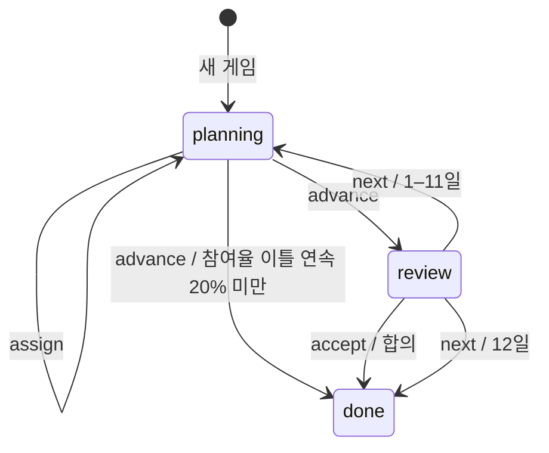

# 파업 웹게임 설계·구현 인수인계

작성일: 2026-09-06  
구현 기준: `6eb821e` (규칙·저장 버전 3, 운영 배포 완료)  
게임: https://cyber-lenin.com/games/strike/

현재 구현과 사용자 피드백으로 확정한 설계를 설명한다. 수치의 최종 기준은 엔진 코드다. 규칙이나 화면을 바꾸면 이 문서와 관련 테스트도 함께 갱신한다.

## 1. 목적과 핵심 개념

「파업기금이 바닥나기 전에」는 가상 공장에서 파업위원회 활동조를 배치하며 최대 12일 동안 임금·노동시간·작업 강도에 관한 합의를 만드는 게임이다. 생산을 멈추는 힘과 생활 지원·조직·휴식을 함께 유지하는 것이 핵심이다. 로그인이나 게임 전용 서버 API 없이 브라우저에서 실행된다. 실제 노동쟁의의 결과를 예측하는 모형이 아니다.

**파업 참여율과 배치 가능한 조 수를 혼동하지 말 것.**

| 개념 | 의미 | 표현 |
| --- | --- | --- |
| 파업 참여율 (`unity`) | 전체 노동자 중 실제로 작업을 멈춘 비율 | % 지표와 공장/정문 사이를 이동하는 작은 노동자 |
| 여섯 활동조 (`crews`) | 플레이어가 배치하는 파업위원회 활동조 | 민서·준호·수진·태호·은별·도윤, 이름과 개별 피로 |
| 작은 노동자 20개 | 전체 노동자의 참여 비율을 나타내는 대표 그림 | 정문에 `round(unity / 5)`개, 나머지는 공장 안 |
| 피켓 | 참여로 감소한 뒤 남은 생산을 추가로 늦추는 활동 | 피켓을 든 활동조와 생산라인 속도 |

작은 노동자 1개가 실제 노동자 1명이라는 뜻은 아니다. 그림은 약 5%p 단위로 반올림하며 계산은 실제 unity를 사용한다. 작은 노동자는 선택·배치할 수 없고 활동조별 부하 유닛도 아니다. 참여율이 올라가도 배치 가능한 활동조는 여섯 조다.

v2는 참여율을 피켓 효율의 보정값으로만 사용했다. 의미와 생산 결과가 맞지 않아 v3에서 참여율 자체가 생산을 줄이도록 바꿨다. 과거 대화의 생산 계산 예시를 현재 규칙으로 인용하지 않는다.

## 2. 사용자 피드백으로 확정한 UI 원칙

- 지도에서 동료를 **드래그 앤 드롭**하거나 **동료 터치 → 장소 터치**로 옮긴다. 둘 다 유지한다.
- 별도 장소 버튼 목록을 만들지 않는다. 지도·동료 목록·장소 버튼을 번갈아 보는 동선이 문제였다.
- 동료 목록은 이름, 현재 장소, 피로 확인용으로 유지한다.
- 피로를 추가 수치 칩으로 빽빽하게 설명하지 않는다. 자세·표정·피켓·회복 표시와 인원 변화로 먼저 전달한다. 세부 수식은 접힌 규칙/개발 문서에 둔다.
- 조직 천막·정문·연대 부스·휴식처에는 장소 일러스트를 사용한다.
- 오늘의 사건은 지도와 같은 현장 영역 상단에 둔다. 관련 장소에도 테두리와 사건 배지를 표시한다.
- 사건 제목은 `오늘의 사건`이다. `배치 전에 확인` 같은 군말을 붙이지 않는다. 저녁에는 `오늘 적용된 사건`으로 바뀐다.
- 하루 결과의 생산·미납·기금·참여 변화는 **각각의 지표 상자**로 표시한다. 서술은 항목과 줄바꿈을 분리한다.
- `파업위원회 기록`은 **최신 일차부터 지표 증감을 보여주는 표**다. 기록 전체를 카드 목록으로 되돌리지 않는다.
- 시작은 `새 게임 시작`, 이어하기는 `N일차 이어하기`처럼 동작을 직접 설명한다.
- 제거한 문구/상자: `동료의 배치와 피로`, `도윤 조 선택 중` 같은 중복 상태 설명, 중복 이동 안내, `오늘의 결정이 내일의 조건이 됩니다.` 상자.
- 설명 문구는 `파업기금은 생활 지원 자금입니다.`를 사용한다.

## 3. 파일 구조

아래 링크는 저장소 안의 상대 경로다.

| 파일 | 책임 |
| --- | --- |
| [strike-engine.js](../public/js/strike-engine.js) | 결정론적 규칙, 상태 전이, 생산·교섭 계산, 저장 복원. 전역 `window.StrikeGame` |
| [strike.js](../public/js/strike.js) | DOM UI, 저장, 배치 콜백, 결과 상자·기록 표·교섭안, 연출 제어 |
| [strike-scene.js](../public/js/strike-scene.js) | SVG 지도, 활동조·노동자·컨베이어·트럭, 입력, 사건 강조. 전역 `window.StrikeScene` |
| [strike.css](../public/css/strike.css) | 화면 배치, 테마, 조작 영역, 피로·회복·생산 애니메이션 |
| [strike.ejs](../views/public/strike.ejs) | 페이지 골격, 시작·현장·결과·기록 영역, 접힌 규칙 |
| [games.ejs](../views/public/games.ejs), [games.css](../public/css/games.css) | 게임 선택 페이지와 공통 스타일 |
| [redirects.js](../routes/redirects.js) | `/games/`, `/games/strike/` 렌더링과 끝 슬래시 정규화 |
| [이미지 프롬프트](../public/images/strike/PROMPTS.md) | 생성 이미지의 프롬프트와 에셋 목록 |
| [test-strike.js](../scripts/test-strike.js) | 규칙·밸런스·결정론·복원 검증 |
| [test-strike-ui.js](../scripts/test-strike-ui.js) | 실제 EJS와 Playwright를 사용하는 브라우저 검증 |

스크립트 로딩 순서는 engine → scene → UI다. CSS/JS URL에는 EJS의 `assetVersion`이 붙는다. 장소 이미지는 `{organize,picket,solidarity,rest}-v1.webp`라는 별도 버전 파일명이다. 교체 시 캐시를 고려해 파일명과 scene 참조를 함께 갱신한다.

게임 라우트 자체는 DB 쿼리를 하지 않는다. 사이트 공통 레이아웃·세션·배포 환경은 공유한다. 한국어 게임이며 현재 영어 전용 게임 문구는 없다.

## 4. 상태와 하루 처리 순서

| 필드 | 의미/초기값 |
| --- | --- |
| `version`, `mode`, `seed` | 3, normal/hard, unsigned 32-bit 사건 시드 |
| `day`, `phase` | 1, planning |
| `fund` | 기본 90 / 어려움 66. 0 이상, 상한 없음 |
| `unity` | 58. 0–100 |
| `production` | 42. 정상 생산을 100으로 둔 비율 |
| `backlog` | 0. 내부 누적 압박량 0–400 |
| `shortage` | 생활 지원 부족의 연속 일수. 초기 0 |
| `crews` | 여섯 조, 각 피로 10. 초기 배치: 피켓·피켓·조직·연대·휴식·휴식 |
| `history` | 완료한 날의 결과와 배치 기록 |
| `offers`, `deal`, `outcome` | 교섭 제안, 체결한 합의, 종료 사유. 초기 null |



엔진의 변경 함수는 입력을 복제해 새 상태를 반환한다. `advance`만 `{ state, events }`를 반환한다. `assign`은 planning, `accept`와 `next`는 review에서만 가능하다. 유효하지 않은 전이는 예외를 던진다.

하루 처리 순서:

1. 그날 사건과 장소별 조 수를 결정한다.
2. 모금·생활 지원 비용·부족액을 계산한다.
3. 모든 조의 피로를 해당 활동에 따라 갱신한다.
4. **갱신한 피로**로 과로 조 수를 세고 참여율을 갱신한다.
5. **갱신한 피로와 참여율**로 그날 생산을 계산한다.
6. 멈춘 생산으로 미납 압박을 갱신한다.
7. 기록과 교섭안을 만들고 참여율에 따른 종료 여부를 판정한다.

배치 직후에는 하루 계산이 실행되지 않는다. 생산·참여·피로는 최근 확정된 상태이며 하루를 보내야 바뀐다. 첫 화면의 생산 42%는 피켓 효과 적용 전의 `100 - 58`이다. `production(start())`와 초기 필드 `start().production`은 다르다.

UI의 `moving`은 엔진 phase가 아니다. 하루 클릭 시 계산과 저장을 먼저 끝내고 1.8초 연출을 표시한다. 연출 중에는 배치를 잠그며 건너뛰기가 가능하다. 동작 줄이기 설정에서는 즉시 마친다. 연출 도중 새로고침해도 하루가 다시 계산되거나 유실되지 않는다.

## 5. 규칙과 계산식

### 활동·피로

| 활동 | 일일 피로 변화 | 효과 |
| --- | ---: | --- |
| 피켓 | +18 | 남은 생산을 추가로 지연 |
| 조직 | +6 | 1조면 참여 +6%p, 2조 이상 총 +8%p |
| 연대 | +8 | 첫 조 +20, 둘째 조 +12, 셋째 이후 조마다 +4 기금 |
| 휴식 | −42 | 피로 회복 |

피로는 0–100으로 제한한다. 조직·연대의 기본 산출에는 피로 효율 감소가 없다. 다만 어느 장소든 **하루 종료 시 피로 75 이상**이면 과로 페널티가 적용된다.

`crewCondition(c)`는 현재 피로에 따른 피켓 힘, 해당 활동 후 피로, 그때 과로할 경우 참여 페널티 3을 반환한다. 현재 피로와 다음 피로를 혼동하지 말 것.

### 생활 기금과 참여

```text
모금 = 첫 연대 조 20 + 둘째 12 + 나머지 조마다 4
       + (연대의 방문이고 연대 조가 있으면 6)
생활비 = 17 + (어려움이면 3)
         + (밀려오는 생활비이면 6 / 도시락이면 -6)
부족액 = max(0, 생활비 - 이전 기금 - 모금)
다음 기금 = max(0, 이전 기금 + 모금 - 생활비)
다음 참여율 = clamp(이전 참여율 + min(8, 조직 조 수 × 6)
                    - 2 - 과로 조 수 × 3
                    - (부족액이 있으면 9), 0, 100)
```

기금이 부족하다고 즉시 종료되지 않는다. `shortage`는 기록하지만 별도 자동 패배 조건으로 쓰지 않는다. 참여 이탈 페널티가 있어도 조직 효과가 더 크면 최종 참여율은 상승할 수 있다.

### 생산

```text
각 피켓 조의 힘 = max(0.25, 1 - 하루 종료 피로 / 110)
피켓 지연율 = min(0.6, 피켓 힘의 합 × 0.08 × 사측 보정)
사측 보정 = 생산 독려 사건이면 0.82, 그 외 1
생산 = round((100 - 하루 종료 참여율) × (1 - 피켓 지연율))
멈춘 생산 = 100 - 생산
```

예: 참여율 60%, 피로 55인 피켓 조 2개, 사측 사건이 없다면 힘의 합 1, 지연율 8%, 생산은 `round(40 × 0.92) = 37%`다.

피켓이 없어도 파업 참여만큼 생산이 줄어든다. 참여율 100%면 생산 0이다. 사측 생산 독려는 **피켓의 추가 지연**에만 영향을 준다.

### 미납과 교섭

```text
미납 압박 = clamp(이전 미납 + 멈춘 생산 × 마감 보정 - 42, 0, 400)
마감 보정 = 4·8·12일에는 1.5, 그 외 1
표시 미납 = ceil(미납 압박 / 40) 대분
평균 피로 = round(여섯 조 피로 합 / 6)
교섭력 P = max(0, round(미납 × 0.13 + 참여율 × 0.34
                       - 평균 피로 × 0.35 - (어려움이면 7)))
```

미납은 물리적인 자동차 생산 단위의 정밀 모형이 아니라 게임 압박값이다. 지도 트럭은 최대 4개만 그리지만 지표는 최대 10대분까지 표시한다. 기금 게이지도 100에서 차지만 실제 기금은 100을 넘을 수 있다.

| 교섭안 | 임금 인상률 | 단축 시간 | 작업 강도 |
| --- | --- | --- | --- |
| 시간도 지키는 안 | min(14, floor(P/6))% | min(4, floor(P/23))시간 | 유지 |
| 임금 중심의 안 | min(18, floor(P/6)+4)% | 0 | +15% |

기준은 주 40시간이다. 임금 +8% 이상, 2시간 이상 단축, 강도 유지에 모두 합의하면 요구 달성이다. 현재 첫 안은 P≥48에서 충족한다. 일부 요구만 충족한 합의도 가능하지만 `won`은 false다.

12일 저녁에도 마지막 제안을 수락할 수 있다. 12일에 `next`를 선택하면 합의 없이 종료한다. 참여율이 이전 상태와 오늘 모두 20% 미만이면 하루 결과를 기록한 뒤 즉시 종료한다.

### 사건

1일은 첫 아침, 4·8·12일은 납품 마감이다. 나머지는 시드와 일차의 정수 해시로 도시락/생활비/생산 독려/연대 방문 중 하나를 고른다. 재접속해도 바뀌지 않는다.

엔진 `event()`가 사건 종류를 결정하고 `advance()`/`production()`이 효과를 적용한다. scene의 `eventCue()`는 같은 종류를 지도 배지·설명·강조 장소로 변환한다. 사건 수정 시 두 곳의 의미가 일치해야 한다. 연대 방문의 +6은 연대에 조를 배치해야만 받는다.

## 6. 지도와 입력 구현

지도는 `viewBox="0 0 800 860"`인 SVG다. 네 장소는 각 370×330이며 좌표와 인물 시작점은 scene의 `areas`에 있다. 같은 장소의 조는 3열×2행으로 배치된다.

| 요소 | 역할 |
| --- | --- |
| `[data-crew-sprite]` | SVG 활동조 그림 |
| `[data-crew-handle]` | 그림 위의 투명한 네이티브 HTML button. 키보드·모바일 입력 |
| `[data-map-job]` | 장소 SVG 그룹. 선택 후 터치와 드롭 목적지 |
| `#strikeWorkforce` | 작은 노동자 20개와 파업 중 표시. pointer-events 없음 |
| `#strikeConveyor`, `#strikeTrucks` | 확정된 생산과 미납 표현 |

모바일에서 SVG만으로 touch-action을 처리했을 때 페이지 스크롤이 개입하는 문제가 있어 HTML 버튼을 사용한다. 버튼의 `touch-action: none`을 유지한다. 버튼 크기 108×100과 좌표 계산은 SVG viewBox에 결합되어 있으므로 지도 비율을 바꾸면 함께 수정한다.

Pointer Events는 host에 위임하고 버튼에서 pointer capture를 잡는다. 화면 좌표는 SVG의 역 CTM으로 변환한다. 6px 이상 이동해야 드래그로 판정하며 드롭 직후 click 중복을 억제한다. 지도 밖 드롭, Esc, pointercancel, capture 상실, 창 blur에서는 원위치로 돌아간다.

**드래그 중 SVG 인물을 다른 부모로 옮기지 않는다.** 이전 구현에서 capture가 취소되는 문제가 있었다. transform과 클래스만 바꾼다. stage는 WeakMap에 보관하고 지도 DOM을 재사용한다.

키보드는 활동조/장소에 초점을 옮겨 Enter 또는 Space로 조작한다. review·done·연출 중에는 배치를 잠근다. 결과와 사건 제목으로의 초점 이동, aria-label, 상태 안내 영역을 유지한다.

### 시각적 상태

| 상태 | 표시 |
| --- | --- |
| 피로 45 이상 | 몸 기울기, 땀, 내려가는 피켓, 목록 표정 변화 |
| 피로 75 이상 | 더 처진 자세·굽힌 다리·낮은 피켓·탈색 |
| 휴식 배치 | 앉은 자세와 z, 피로가 남아 있으면 회복 + |
| 회복 후 재배치 | 다시 선 자세와 정상 피켓 |
| 참여율 변화 | 동일한 작은 노동자 DOM이 공장↔정문 이동, 옷 색 변화 |
| 생산 변화 | 컨베이어 주기 `100 / max(1, production)`초 |
| 생산 0 / 종료 | 컨베이어 정지 |

피로 45는 시각적 단계이지 새로운 규칙 페널티의 시작점이 아니다. 피켓 힘은 피로에 따라 연속적으로 감소하고 과로 참여 페널티는 75에서 발생한다. 휴식 배치만으로 숫자가 즉시 회복되지는 않는다.

`prefers-reduced-motion`에서는 관련 이동·연출을 줄이거나 끈다. 숫자와 접근성 설명으로도 상태를 파악할 수 있어야 한다.

## 7. 결과와 저장

하루 기록은 `day, event, income, cost, production, backlog, fund, unity, jobs, messages`를 저장한다. 결과 상자는 절대값과 전날 대비 증감을 함께 보여주며 1일차는 시작 상태와 비교한다. 기금 상자의 생활 지원액은 실제 지급액이다. 기록 표는 최신 일차부터 생산·미납·기금·참여의 **증감**만 보여준다.

현재 `narrative()`는 `messages`의 인덱스 1·2를 숫자 문장으로 간주해 제외한다. 엔진 메시지 순서를 바꾸면 이 결합을 반드시 확인한다. 구조화된 서술 필드로 바꿀 여지는 있으나 아직 구현하지 않았다.

저장은 `localStorage['strike-game-v3-save']` 한 슬롯이다.

- 새 게임, 하루 진행, 다음 날, 합의 시 저장한다.
- **배치 변경만으로는 저장하지 않는다.** 확정 전 배치 수정은 새로고침하면 사라질 수 있다.
- `restore()`는 저장된 기금·참여·피로 등을 그대로 신뢰하지 않는다. 시드와 일별 배치를 새 게임부터 재생해 재구성한다.
- planning에 저장된 배치도 검증 후 적용한다. 비정상 JSON·버전·phase·day·배치는 null로 거절한다.
- 종료 상태에는 이어하기 버튼을 표시하지 않는다.
- 저장이 차단돼도 현재 화면에서 플레이할 수 있고 실패를 알린다.
- 계정 동기화나 서버 저장은 없다.

v2 판을 v3 규칙으로 재생하면 결과가 달라지므로 **자동 이관하지 않는다**. v2 키는 삭제하지 않고 유효한 v3 저장이 없을 때 규칙 개편과 새 게임 필요를 안내한다.

앞으로 수치·사건·종료 규칙을 바꾸면 재생 결과도 달라진다. 같은 저장 버전으로 조용히 규칙을 바꾸지 말고 버전별 엔진 유지, 명시적 이관, 새 버전 시작 중 적절한 방식을 선택한다. 현 버전은 구 엔진을 유지하지 않고 새 버전 시작을 택했다.

## 8. 검증과 밸런스 기준

저장소 루트에서 실행한다.

```bash
node scripts/test-strike.js
node scripts/test-strike-ui.js
npm test
```

규칙 테스트는 Node VM에서 엔진을 로드하며 DB·브라우저가 필요 없다. 2개 난이도 × 7개 전략 × 32개 시드 = 448개 캠페인을 검사한다.

| 전략 | 피로가 낮은 조부터 배치하는 순서 |
| --- | --- |
| balanced | 피켓 3, 조직 1, 연대 1, 휴식 1 |
| pressure | 3의 배수가 아닌 날 피켓 4·연대 1·휴식 1, 3의 배수인 날 조직 2·연대 1·휴식 3 |
| support | 첫 3일 조직 2·피켓 1·연대 2·휴식 1, 이후 balanced |
| 단일 활동 4종 | 모든 조를 계속 같은 활동에 배치 |

앞의 세 전략은 각 난이도/시드에서 한 번 이상 요구 달성 가능한 제안을 받아야 한다. 매일 같은 조를 혹사하는 전략이 아니라 **피로 순으로 교대하는 전략**이다. 피켓·연대·휴식만 반복하는 전략은 승리하지 않아야 한다. 조직만 반복하는 전략은 일부 시드에서 성공할 수 있지만 모든 시드에서 성공하면 실패로 처리한다. 승리 수는 최종일만이 아니라 캠페인 중 합의 가능성을 센다.

추가 검증: 불변성, 결정론, 자원 범위, 복원 재현, 지원 부족 후 회복, 마지막 날 합의, 피로 경계, 참여/피로와 생산의 방향, 구버전 거절. 448개 통과는 모든 전략의 재미나 현실성을 보장하지 않는다.

UI 테스트는 임시 로컬 Express 서버에서 실제 라우트·EJS·정적 파일을 제공하고 Playwright Chromium으로 검증한다. Playwright 패키지와 Chromium 실행 환경이 필요하다. DB·Redis 없이 수행하며 외부 리소스 요청은 차단한다.

검증 범위: 마우스/터치 드래그, 탭 배치, 취소, 키보드, 같은 장소 여섯 조, 사건 강조, 피로·회복·참여 그림, 지표 상자와 기록 표, 두 난이도 합의, 12일 종료, 저장 복원·손상·차단·v2 안내, 연출 잠금/건너뛰기, 360·390·1280 폭 및 다크/라이트 화면.

스크린샷은 `/tmp/strike-mobile.png`, `/tmp/strike-desktop.png`, `/tmp/strike-fatigue-before.png`, `/tmp/strike-fatigue-after.png` 등에 생성된다. 임시 산출물이므로 저장소에 보관된 자료가 아니다.

`npm test`는 규칙 테스트를 포함하지만 **Playwright UI 테스트는 포함하지 않는다**. 지도·조작 수정 시 별도 실행한다. 호스트 Node가 20 미만이면 테스트 스크립트가 Node 20 Docker로 전환하므로 Docker 접근이 필요하다.

기준 커밋 배포 시 규칙/UI 테스트, 전체 npm test, 운영 브라우저의 v3 저장·참여 그림·결과·구버전 안내, 배포 스크립트의 20개 경로 200 응답 및 DB 검사를 통과했다.

## 9. 수정·배포 절차

1. 현재 코드와 기준 커밋 이후 변경을 확인한다.
2. 규칙, UI, 지도, 에셋 중 해당 파일을 수정한다.
3. 규칙 변경이면 하루 순서·생산 예시·교섭 밸런스·저장 호환성을 함께 검토한다.
4. 관련 테스트를 실행하고 모바일 실화면에서 조작 동선과 피로의 가시성을 확인한다.
5. 배포할 변경은 커밋·원격 반영 후 공식 스크립트를 사용한다.

프로젝트 파일 생성·수정 및 Git 작업은 `grass` 사용자로 한다. root로 접속했으면 먼저 해당 사용자로 전환한다. 운영 컨테이너를 임의의 `docker run`으로 재생성하지 않는다.

```bash
scripts/deploy --restart
```

스크립트는 원격/로컬 리비전과 작업 트리를 확인하고 npm test, 이미지 빌드, 운영 재생성, 상태·경로·DB 검사와 캐시 예열을 수행한다. 정확한 운영 규칙은 [AGENTS.md](../AGENTS.md)와 [scripts/deploy](../scripts/deploy)를 따른다.

운영 컨테이너는 `leninbot-frontend`, DB는 `leninbot-pg`, 공통 네트워크는 `leninbot_default`다. 다른 페이지 콘텐츠가 갑자기 비면 frontend 로그의 5432 연결 오류, DB 상태, 네트워크 연결을 확인하고 `/`, `/posts`, `/reports`, `/hub`, `/ai-diary`를 재확인한다.

문서만 수정하는 작업에는 게임 재배포가 필요 없다.

## 10. 후속 검토 사항

현 동작의 한계 또는 개선 여지이며, 확정된 추가 작업 요청은 아니다.

- 확정 전 배치 자동 저장 여부는 현재 UX와 복원 정책을 함께 보고 결정할 수 있다.
- 작은 노동자는 약 5%p 단위이므로 1–2%p 변화를 항상 움직임으로 보여주지는 않는다.
- 미납 트럭 수·기금 게이지의 표시 상한을 실제 상태 상한과 혼동하지 않는다.
- 결과 서술의 messages 인덱스 의존은 데이터 구조 변경에 취약하다.
- 사건의 엔진 설명과 지도 설명은 별도 관리된다. 설명과 실제 계산의 불일치를 피한다.
- 실시간 배치 예상치를 도입한다면 확정된 결과와 구분하면서도 수치와 문구를 과도하게 늘리지 않아야 한다.
- 활동조 수 6은 평균 피로, 초기 상태, 복원 검증, 지도 배치, 테스트에 결합되어 있다. 조 수 변경은 이름 배열 추가만으로 끝나지 않는다.
